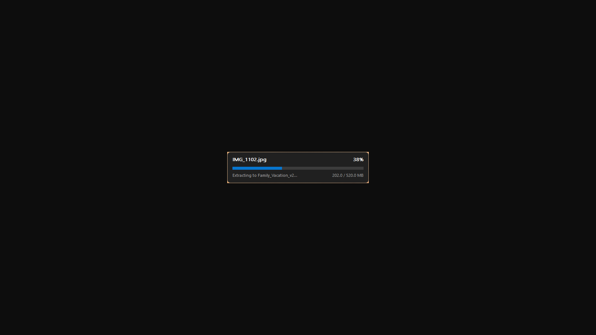

<div align="center">


# AirZip

**Unzip like a Mac. On Windows.**

A lightweight archive extractor with zero runtime dependencies — a single 2.1 MB executable
that needs no .NET, no Visual C++ redistributable, and no setup wizard.

[](https://apps.microsoft.com/detail/9NN6H81H7JBL)
[](https://github.com/abdul-karim-mia/AirZip/releases/latest/download/AirZip.exe)
[](LICENSE)
[](#requirements)

[Website](https://airzip.vercel.app) · [Features](https://airzip.vercel.app/features.html) · [Installation](https://airzip.vercel.app/installation.html) · [Releases](https://github.com/abdul-karim-mia/AirZip/releases)

</div>

---

## Why

On macOS you double-click an archive and the files are simply *there*. No dialog asking
where to put them, no file manager to close, no install to sit through.

Windows never got the simple version. Every extractor wants to be a file manager. AirZip
wants to be a verb: point it at an archive, get the files, move on. If extraction finishes
quickly, you never even see a window.

It's free, open source, and contains no networking code at all — there is nothing for it
to send anywhere.

<div align="center">

<br><em>The entire interface. That is all of it.</em>
</div>

---

## Install

| | |
|---|---|
| **[Microsoft Store](https://apps.microsoft.com/detail/9NN6H81H7JBL)** *(recommended)* | Automatic updates, signed by Microsoft, no admin rights needed |
| **[Standalone .exe](https://github.com/abdul-karim-mia/AirZip/releases/latest/download/AirZip.exe)** | Portable — runs from a USB stick, works offline, no installation |

The standalone build is not signed with an EV certificate, so SmartScreen may show
"Windows protected your PC" on first run. Click **More info → Run anyway**, or use the
Store build.

To register AirZip as the handler for all 12 archive types:

```cmd
AirZip.exe --install
```

### Requirements

Windows 10 version 1809 (build 17763) or newer, x64. Nothing else — the C runtime is
linked statically and only Windows' own system DLLs are used.

---

## Features

**Smart folder handling.** One root item inside the archive and it extracts *beside* the
source file, because the archive already did the organising. Several loose root items and
AirZip creates a folder named after the archive. No Downloads-folder explosion, and no
pointless `foo/foo/foo` nesting.

**Multi-volume support.** Hand it `backup.7z.001` and it finds `.002`, `.003` and the rest,
then streams them as one continuous file through a spanning stream. Progress reflects the
whole set, not one volume.

**Live theme switching.** Follows the Windows light/dark setting and keeps listening —
change your theme mid-extraction and the window redraws immediately. The progress bar
colour is read from your DWM accent setting.

**A window only when it's earned.** The progress window is held back for 400 ms. Small
archives finish inside that window and never flash anything on screen. Larger ones get a
proper readout: current filename, percentage, and bytes done against the total.

**Zip-slip defence.** Archive entry paths are validated before anything is written.
Absolute paths and `..` traversals are rejected, so extraction cannot escape the
destination folder whatever the archive claims its contents are called.

**Completion chime.** Plays `SystemAsterisk`, which means it respects your Sound scheme —
silence that and AirZip stays quiet too.

**Password prompt** for encrypted archives, instead of a cryptic failure.

Per-monitor DPI aware, long-path aware, UTF-8 code page aware.

---

## Supported formats

Extraction is handled by the official 7-Zip engine, embedded in the executable as an
RCDATA resource and unpacked to `%TEMP%\AirZip` on first run.

`.zip` · `.7z` · `.rar` · `.tar` · `.gz` · `.bz2` · `.xz` · `.iso` · `.cab` · `.lzma` ·
`.wim` · `.arj`

Split volumes such as `.7z.001` are joined automatically, and nested archives like
`.tar.gz` unpack in a single pass. Encrypted archives get a password prompt.

Spotted something worth improving?
[Open an issue](https://github.com/abdul-karim-mia/AirZip/issues) — sample archives are
especially welcome, since each one becomes a permanent regression test.

---

## Usage

```cmd
AirZip.exe <archive>
AirZip.exe --install
AirZip.exe --silent-install
AirZip.exe --uninstall
AirZip.exe --silent-uninstall
AirZip.exe --version
AirZip.exe --help
```

| Option | Result | Elevation |
|---|---|---|
| `<archive>` | Extract the archive | No |
| `--install` | Install and register all 12 file types | Prompts |
| `--silent-install` | Same, with no dialogs — for scripts | Required |
| `--uninstall` | Uninstall and restore previous handlers | Prompts + confirms |
| `--silent-uninstall` | Same, with no dialogs | Required |
| `--version` | Print version | No |
| `--help` | Print usage | No |

**Exit codes:** `0` success · `1` failed · `2` bad usage · `3` file not found · `4` not elevated

### Reading the exit code

AirZip is a GUI-subsystem binary, so `cmd.exe` does **not** wait for it — it returns
immediately and you would read the wrong code. Force the wait:

```cmd
start /wait AirZip.exe archive.zip
echo %ERRORLEVEL%
```

```powershell
$p = Start-Process AirZip.exe -ArgumentList 'archive.zip' -Wait -PassThru
$p.ExitCode
```

---

## File associations

AirZip never takes over your file types silently. It becomes the default handler only if
you run `--install` or set it yourself in **Settings → Apps → Default apps**.

`--install` registers 12 extensions: `.zip` `.rar` `.7z` `.tar` `.gz` `.bz2` `.xz` `.iso`
`.cab` `.lzma` `.wim` `.arj`, and adds an entry to Add/Remove Programs.

Before AirZip claims an extension, the existing handler is backed up to
`HKLM\SOFTWARE\AirZip\Associations`. On uninstall they are restored from that backup — or,
if the backup is missing, AirZip falls back to a classic ProgID from `OpenWithProgids`
(for example `CompressedFolder` for `.zip`).

**Two caveats on uninstall:**

- When installed in Program Files, uninstall is asynchronous. A running executable cannot
  delete itself, so the work is handed to a temporary clone and the original process
  returns immediately.
- `.arj`, `.lzma` and `.wim` may end up unassociated if the only handler available to
  restore was an AppX package identity, which Windows won't accept as a plain file-type
  default. This is a limitation of the restore heuristic, not of extraction.

---

## Building from source

**Requirements:** Visual Studio 2022 Build Tools (or Community/Professional/Enterprise)
with the C++ workload, plus the Windows SDK. `7z.dll` and `icon.ico` must be present at the
repository root — the resource compiler embeds both into the exe.

```cmd
git clone https://github.com/abdul-karim-mia/AirZip
cd AirZip\native
build.cmd
```

Output lands at `native\out\AirZip.exe`. The script probes the standard Visual Studio
installation roots directly, avoiding `vswhere` because of cmd.exe's parentheses parsing.

> [!IMPORTANT]
> **`build.cmd` must keep CRLF line endings.** With LF-only endings `cmd.exe` cannot
> resolve the `:probe` label and fails with *"The system cannot find the batch label
> specified"*. Watch your git autocrlf settings.

---

## How it's built

AirZip is written directly against the Win32 API — no framework, no UI toolkit, nothing
between the code and the operating system. Everything it needs is compiled into one
executable, which is what keeps it this small and this quick to start.

| | |
|---|---|
| **Language** | C++ against the raw Win32 API — no framework, no UI toolkit |
| **Extraction engine** | 7-Zip via its COM interfaces (`7z.dll`, 1.8 MB, embedded as an RCDATA resource) |
| **C runtime** | Linked statically — no redistributable needed |
| **System DLLs** | `ole32` `oleaut32` `shell32` `dwmapi` `uxtheme` `winmm` `advapi32` `user32` `gdi32` `kernel32` |
| **Third-party deps** | None beyond 7-Zip |
| **Binary size** | 2,193,408 bytes (2.1 MB) |
| **Architecture** | x64 only |

### Repository layout

```
7z.dll                  7-Zip engine, embedded into the exe at build time
icon.ico                Application icon, embedded at build time
icon.png                Source artwork
LICENSE                 MIT, plus the 7-Zip LGPL notice
native/airzip.cpp       The entire program
native/airzip.rc        Resources: manifest, icon, embedded 7z.dll, version info
native/airzip.manifest  asInvoker, common controls v6, per-monitor DPI, long paths
native/resource.h       Resource IDs
native/build.cmd        Build script (CRLF required)
native/out/AirZip.exe   Build output
msix/                   MSIX packaging for the Microsoft Store
store-listing/          Store description, privacy policy, screenshots
test_archives/          Regression samples
website/                Landing page (static, deployed to Vercel)
```

---

## Privacy

AirZip collects nothing. No personal data, no usage data, no telemetry, no crash reporting.
It never connects to the internet — there is no networking code in the binary. It requests
no permissions beyond `runFullTrust` to run as a desktop app, and reads and writes only the
files you explicitly point it at.

---

## Scope

AirZip is a dedicated extractor. Unpacking archives is the one job it does, and keeping
that scope tight is what keeps the binary at 2.1 MB and instant to launch. It sits happily
alongside whatever else you use.

---

## Contributing

Issues and pull requests are welcome. Sample archives for the untested formats are
especially useful — they turn straight into regression tests.

---

## Licence

AirZip is released under the [MIT License](LICENSE) — free to use, modify and redistribute.

Extraction is powered by the **7-Zip engine** (LGPL) — `7z.dll` © 1999–2024 Igor Pavlov,
shipped unmodified and dynamically linked. See [NOTICE](store-listing/NOTICE.txt) and the
[7-Zip licence](https://www.7-zip.org/license.txt).

---

<div align="center">

Built by **[Abdul Karim Mia](https://abdulkarimmia.in/)**

</div>
